设计模式原则、定义、类图、示例等整理.

<!--more-->

## 六大原则

1. 单一职责原则(SRP): 类改变的原因有且仅有一个.
    > 一个类其实就代表一个概念,这是非常抽象的,是在人理解的范畴.而落地到机器理解,需要具体化,也即是通过行为进行定义和约束,这些行为共同构成了类的职责.
2. 开闭原则(OCP): 一个软件实体,如类、模块和函数应该对扩展开放,对修改关闭.
    > 核心原则,对提供方支持扩展以添加功能,对使用方应关闭修改.
3. 里氏替换原则(LSP): 所有引用基类的地方必须能透明地使用其子类的对象.
    > 讨论的是对象的替换,子类的实现应该覆盖父类的实现以实现职责的继承,但是父类的概念应该覆盖子类的概念,这样才能安全的使用多态.
4. 接口隔离原则(ISP): 使用多个隔离的接口,比使用单个接口要好.
    > 如果只依赖了接口的一小部分方法,可以考虑将大接口拆分成多个小接口,单独进行依赖.单一职责是从提供方角度看,一个类只提供职责相关的方法；接口隔离是从使用方角度看,屏蔽掉不需要关心的接口方法.
5. 依赖倒置原则(DIP): 高层模块不应该依赖于底层模块,两者都应该依赖抽象.抽象不应该依赖于细节,细节应该依赖抽象.
    > 高层模块、底层模块、抽象、细节,这些中抽象最高,以抽象指导实现,而不是实现倒逼抽象.
6. 迪米特法则(Law of Demeter): 一个类应该对自己需要耦合或调用的类知道得最少.
    > 接口隔离原则局限于接口及其方法,迪米特法则指定的依赖不仅仅包含接口、方法.一个类只和直接朋友(依赖、关联、组合、聚合等)通信.

按照优先级排名:开闭原则 > 依赖倒置原则 > 单一职责原则 > 里氏替换原则 > 迪米特法则 > 接口隔离原则

## 整体概览


## 详解

### 创建型模式

#### 单例模式

> 定义:确保某一个类只有一个实例,而且自行实例化并向整个系统提供这个实例.

类图如下:

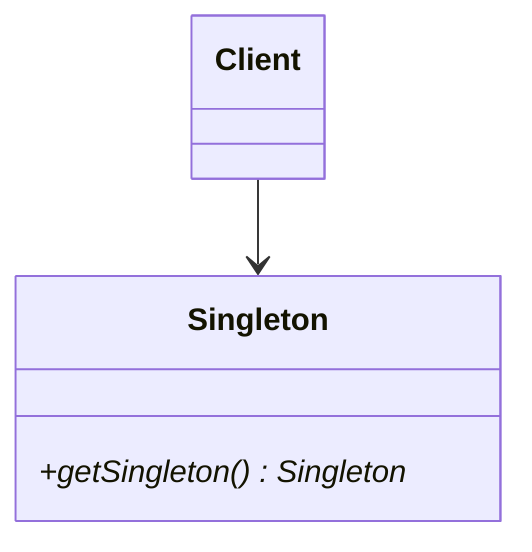
```mermaid
classDiagram
    class Client
    %% 单例角色
    class Singleton {
        +getSingleton()* Singleton
    }

    Client --> Singleton
```

饿汉式:

```java
public class Singleton {
    private Singleton() {}
    // 静态常量
    private static Singleton instance = new Singleton();
    // 也可以使用静态代码块
    // static {
    //     instance = new Singleton();
    // }
    public static Singleton getSingleton() {
        return instance;
    }
}
```

懒汉式:

```java
public class Singleton {
    private Singleton() {}
    // 使用 synchronized 同步,加锁效率低
    // private static Singleton instance;
    // public static synchronized Singleton getSingleton() {
    //     if(instance == null) {
    //         instance = new Singleton();
    //     }
    //     return instance;
    // }
    // 双重校验
    // 网上说因为指令重排序必须加 volatile,实际高版本 Java 中对象 new 操作和初始化操作设计为原子操作,已经禁止重排序,所以其实不必加
    private static volatile Singleton instance;
    public static Singleton getSingleton() {
        if(instance == null) {
            synchronized(Singleton.class) {
                if(instance == null) {
                    instance = new Singleton();
                }
            }
        }
        return instance;
    }
}
```

静态内部类:

```java
public class Singleton {
    private Singleton() {}
    private static class SingletonHolder {
        private static final Singleton INSTANCE = new Singleton();
    }
    public static Singleton getSingleton() {
        return SingletonHolder.INSTANCE;
    }
}
```

枚举单例:

```java
enum Singleton {
    INSTANCE;
    public void method() {
        // TODO
    }
}
```

实际示例:JDK 的 `java.lang.Runtime`

#### 工厂方法模式

> 定义:定义一个用于创建对象的接口,让子类决定实例化哪一个类.工厂方法使一个类的实例化延迟到其子类.

类图:

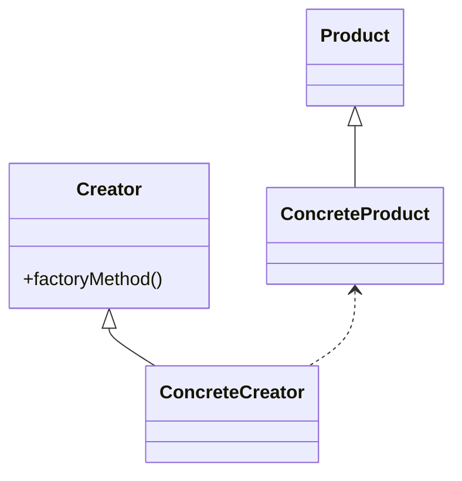
```mermaid
classDiagram
    class Product
    class Creator {
        +factoryMethod()
    }
    class ConcreteProduct
    class ConcreteCreator

    Product <|-- ConcreteProduct
    Creator <|-- ConcreteCreator
    ConcreteProduct <.. ConcreteCreator
```

实际示例:JDK 的 `java.util.Calendar`

#### 抽象工厂模式

> 定义:为创建一组相关或相互依赖的对象提供一个接口,而且无需指定他们的具体类.

类图:

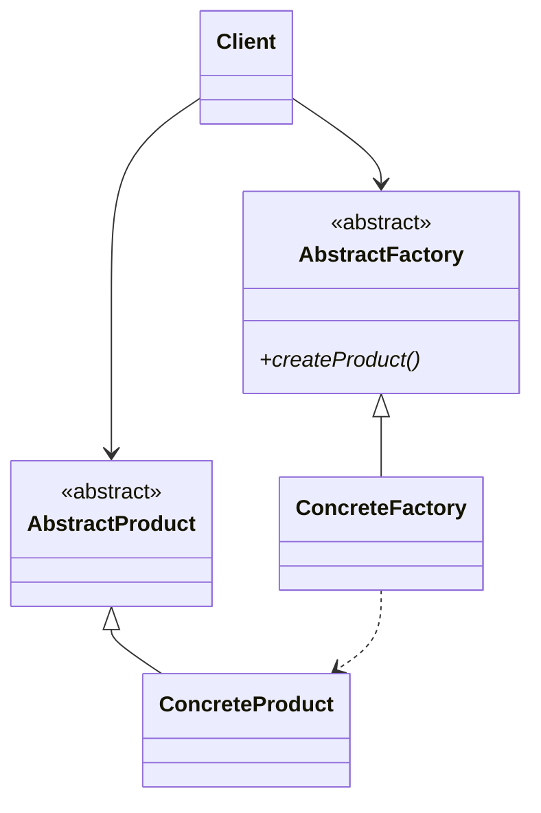
```mermaid
classDiagram
    class Client
    class AbstractProduct {
        <<abstract>>
    }
    class AbstractFactory {
        <<abstract>>
        +createProduct()*
    }
    class ConcreteProduct
    class ConcreteFactory
    Client --> AbstractProduct
    Client --> AbstractFactory
    AbstractProduct <|-- ConcreteProduct
    AbstractFactory <|-- ConcreteFactory
    ConcreteFactory ..> ConcreteProduct
```

#### 原型模式

> 定义:用原型实例指定创建对象的种类,并且通过拷贝这些原型创建新的对象.

类图:

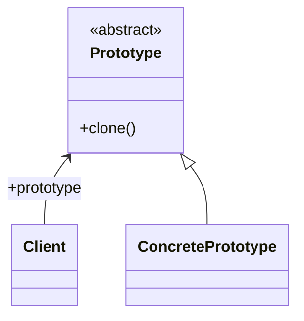
```mermaid
classDiagram
    class Client
    class Prototype {
        <<abstract>>
        +clone()
    }
    class ConcretePrototype
    Prototype <-- Client  : +prototype
    Prototype <|-- ConcretePrototype
```

深拷贝实现方式:

1. 重写 `clone()` 方法,单独拷贝引用类型属性.
2. 使用序列化

实际示例:Spring 的 `scope="prototype"` 机制,实现参考 `ClassPathXmlApplicationContext`.

#### 建造者模式

> 定义:将一个复杂对象的构建与它的表示分离,使得同样的构建过程可以创建不同的表示.

类图:

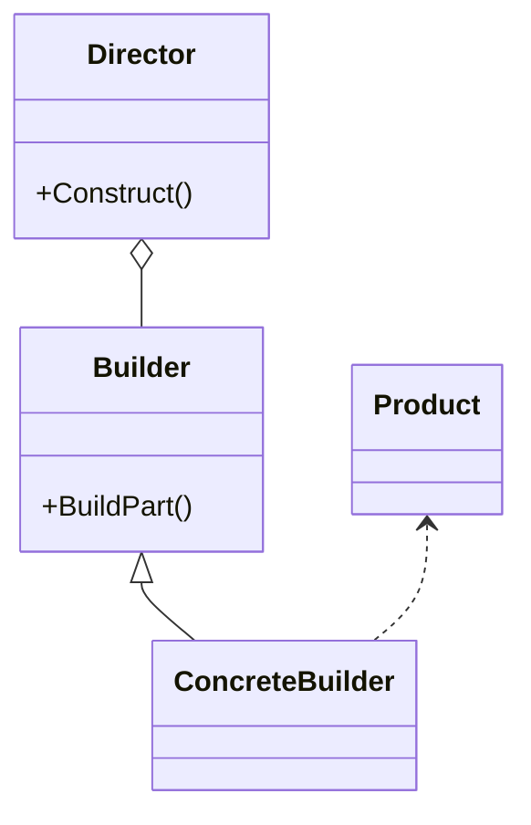
```mermaid
classDiagram
    class Director {
        +Construct()
    }
    class Builder {
        +BuildPart()
    }
    class ConcreteBuilder
    class Product
    Director o-- Builder
    Builder <|-- ConcreteBuilder
    Product <.. ConcreteBuilder
```

### 结构型模式

#### 适配器模式

> 定义:将一个类的接口变换成客户端所期望的另一种接口,从而使原本因接口不匹配而无法在一起工作的两个类能够在一起工作.

类图:

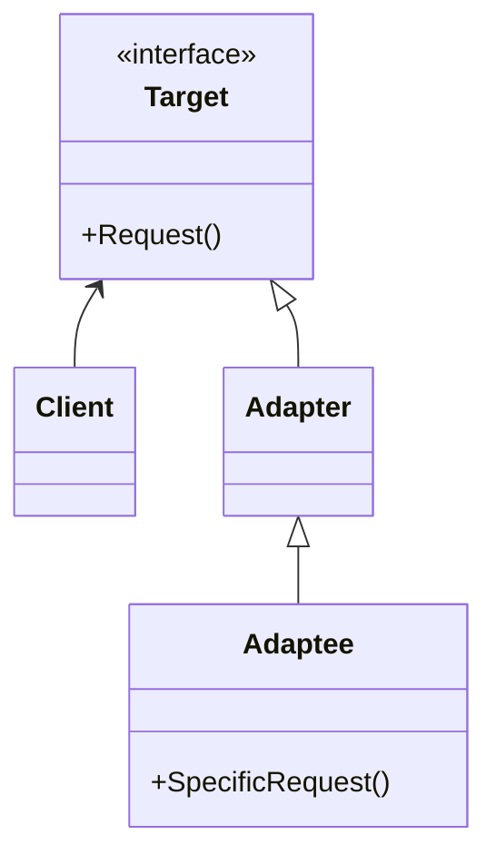
```mermaid
classDiagram
    class Client
    class Target {
        <<interface>>
        +Request()
    }
    class Adaptee {
        +SpecificRequest()
    }
    class Adapter
    Target <-- Client
    Target <|-- Adapter
    Adapter <|-- Adaptee
```

#### 桥接模式

> 定义:将抽象和实现解耦,使得两者可以独立的变化.

类图:

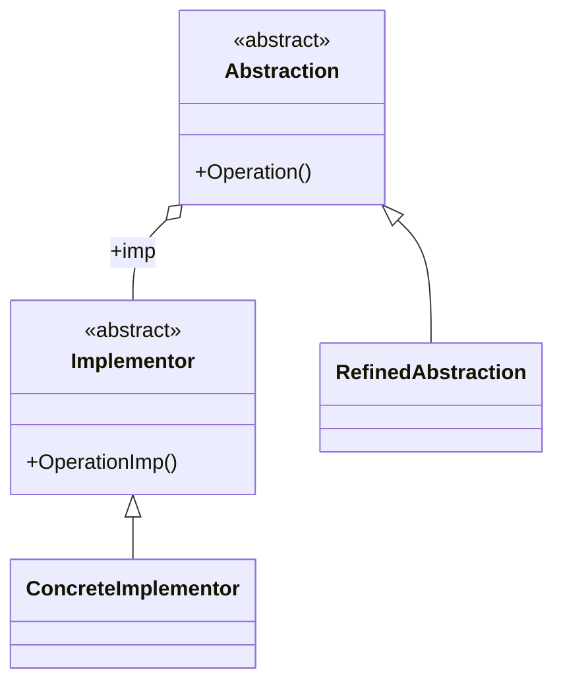
```mermaid
classDiagram
    %% 抽象化角色
    class Abstraction {
        <<abstract>>
        +Operation()
    }
    %% 实现化角色
    class Implementor {
        <<abstract>>
        +OperationImp()
    }
    %% 修正抽象化角色
    class RefinedAbstraction
    %% 具体实现化角色
    class ConcreteImplementor
    Abstraction <|-- RefinedAbstraction
    Abstraction o-- Implementor : +imp
    Implementor <|-- ConcreteImplementor
```

#### 装饰模式

> 定义:动态地给一个对象添加一些额外的职责.就增加功能来说,装饰模式相比于生成子类更为灵活.

类图:

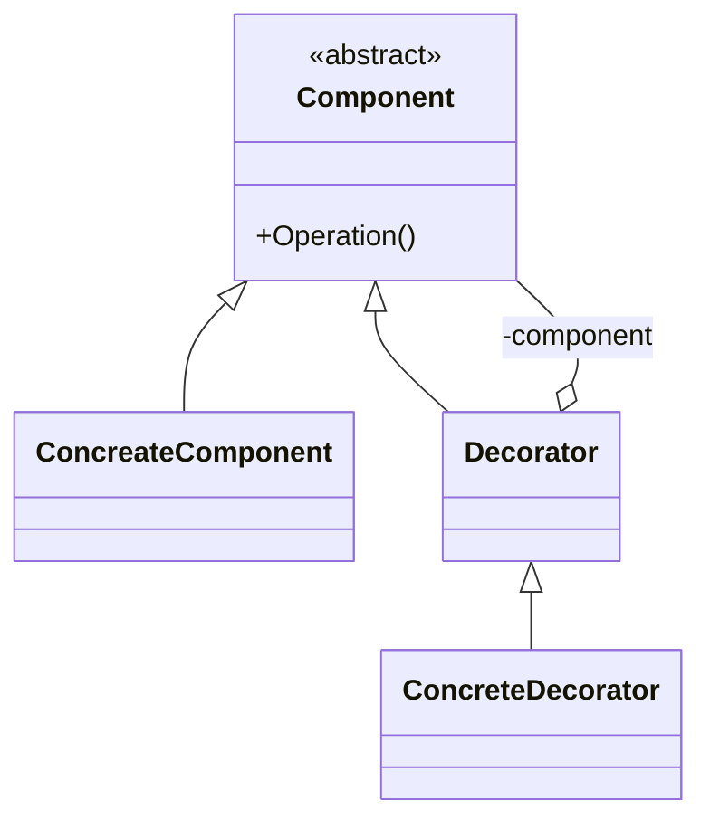
```mermaid
classDiagram
    class Component {
        <<abstract>>
        +Operation()
    }
    class ConcreateComponent
    class Decorator
    class ConcreteDecorator
    Component <|-- ConcreateComponent
    Component <|-- Decorator
    Decorator <|-- ConcreteDecorator
    Component --o Decorator : -component
```

#### 组合模式

> 定义:将对象组合成树形结构以表示“部分-整体”的层次结构,使得用户对单个对象和组合对象的使用具有一致性.

类图:

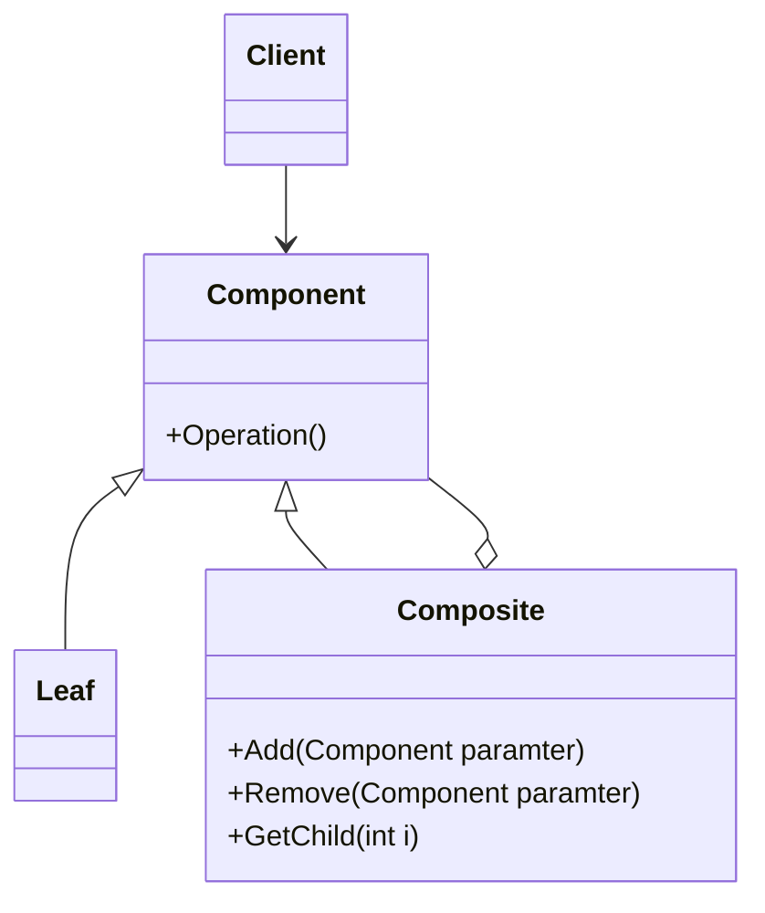
```mermaid
classDiagram
    class Client
    class Component {
        +Operation()
    }
    class Leaf
    class Composite {
        +Add(Component paramter)
        +Remove(Component paramter)
        +GetChild(int i)
    }
    Component <|-- Leaf
    Component <|-- Composite
    Client --> Component
    Composite o-- Component
```

#### 外观模式

> 定义:要求一个子系统的外部与其内部的通信必须通过一个统一的对象进行.外观模式提供一个高层次的接口,使得子系统更易于使用.

类图:

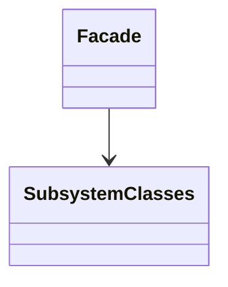
```mermaid
classDiagram
    class Facade
    class SubsystemClasses
    Facade --> SubsystemClasses
```

#### 享元模式

> 定义:使用共享对象可有效地支持大量的细粒度的对象.

类图:

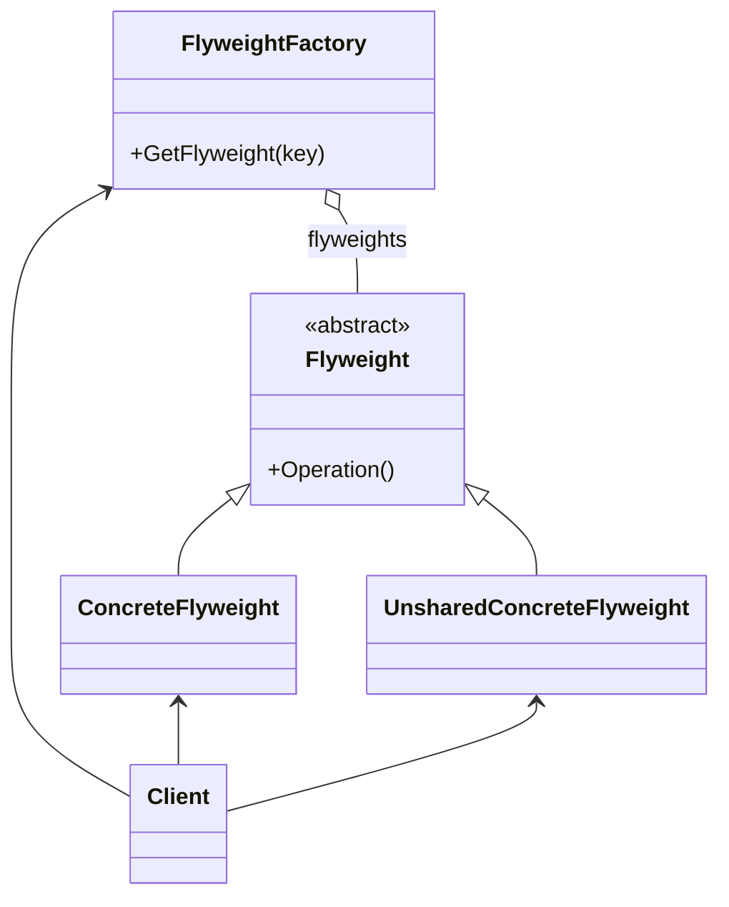
```mermaid
classDiagram
    %% 享元工厂
    class FlyweightFactory {
        +GetFlyweight(key)
    }
    %% 抽象享元角色
    class Flyweight {
        <<abstract>>
        +Operation()
    }
    %% 具体享元角色
    class ConcreteFlyweight
    %% 不可共享的享元角色
    class UnsharedConcreteFlyweight
    class Client
    Flyweight <|-- ConcreteFlyweight
    Flyweight <|-- UnsharedConcreteFlyweight
    FlyweightFactory o-- Flyweight : flyweights
    FlyweightFactory <-- Client
    ConcreteFlyweight <-- Client
    UnsharedConcreteFlyweight <-- Client
```

#### 代理模式

> 定义:为其他对象提供一种代理以控制对这个对象的访问.

类图:

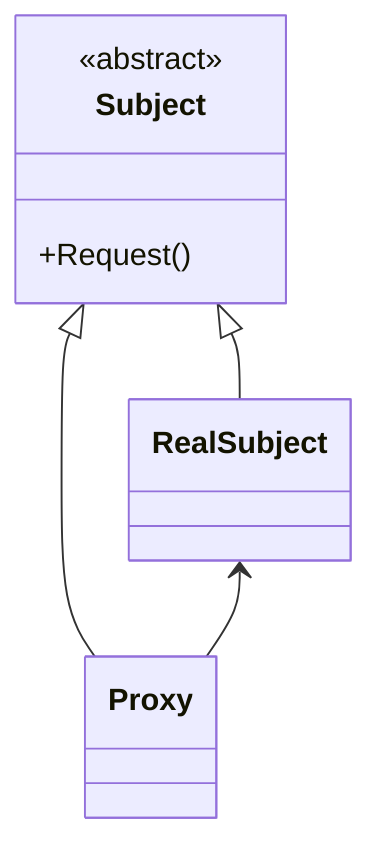
```mermaid
classDiagram
    class Subject {
        <<abstract>>
        +Request()
    }
    class RealSubject
    class Proxy
    Subject <|-- RealSubject
    Subject <|-- Proxy
    RealSubject <-- Proxy
```

### 行为型模式

#### 模板方法模式

> 定义: 定义一个操作中算法的框架,而将一些步骤延迟到子类中.使得子类可以不改变一个算法的结构即可重定义该算法的某些特定步骤.

类图:

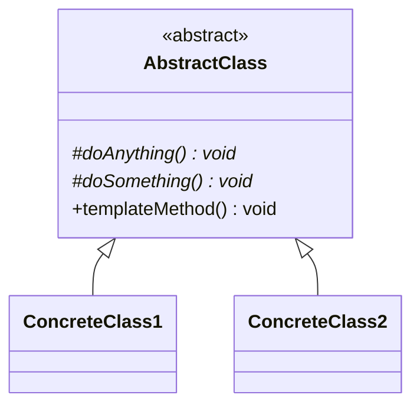
```mermaid
classDiagram
    class AbstractClass {
        <<abstract>>
        #doAnything()* void
        #doSomething()* void
        +templateMethod() void
    }
    class ConcreteClass1
    class ConcreteClass2
    AbstractClass <|-- ConcreteClass1
    AbstractClass <|-- ConcreteClass2
```

#### 命令模式

> 定义:将一个请求封装成一个对象,从而让你使用不同的请求把客户的参数化,对请求排队或者记录请求日志,可以提供命令的撤销和恢复功能.

类图:

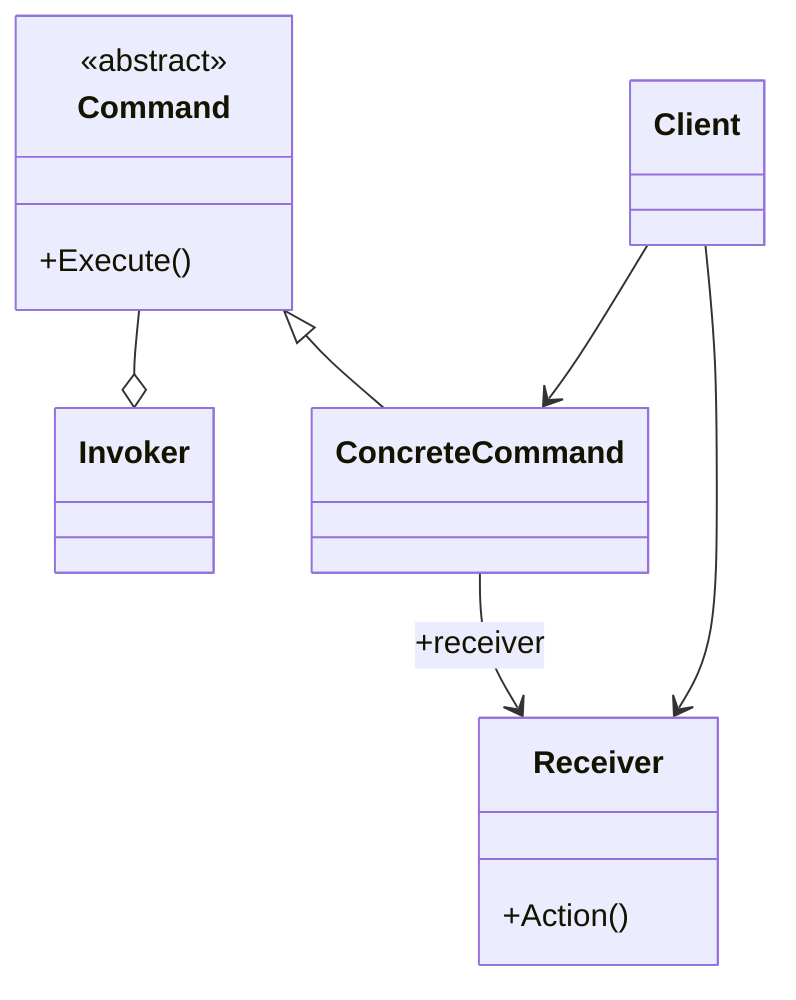
```mermaid
classDiagram
    class Client
    class Invoker
    class Command {
        <<abstract>>
        +Execute()
    }
    class Receiver {
        +Action()
    }
    class ConcreteCommand
    Command <|-- ConcreteCommand
    Command --o Invoker
    ConcreteCommand --> Receiver : +receiver
    Client --> Receiver
    Client --> ConcreteCommand
```

#### 访问者模式

> 定义:封装一些作用于某种数据结构中的各原始的操作,它可以在不改变数据结构的前提下定义作用于这些原始的新的操作.

类图:

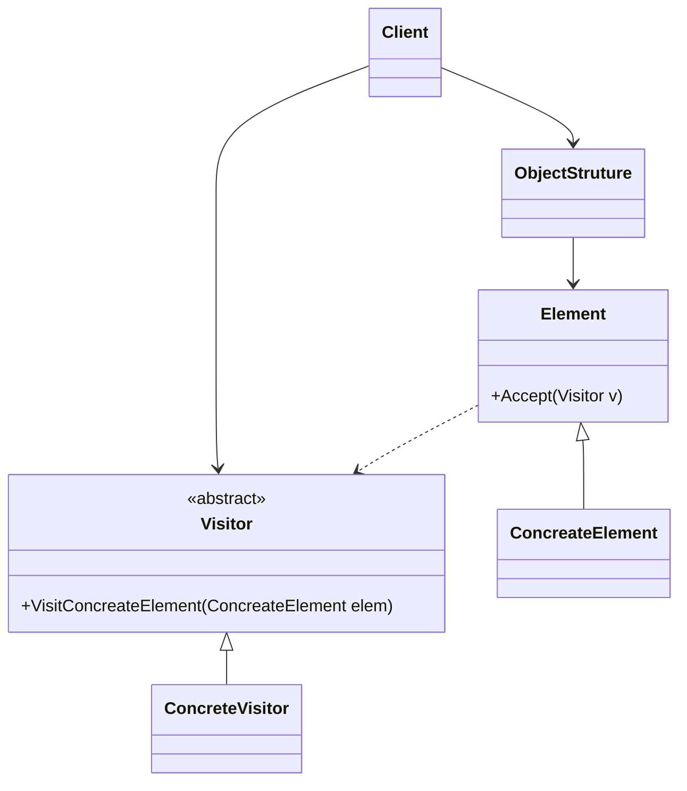
```mermaid
classDiagram
    class Client
    %% 抽象访问者
    class Visitor {
        <<abstract>>
        +VisitConcreateElement(ConcreateElement elem)
    }
    %% 结构对象
    class ObjectStruture
    %% 具体访问者
    class ConcreteVisitor
    %% 抽象元素
    class Element {
        +Accept(Visitor v)
    }
    %% 具体元素
    class ConcreateElement
    Visitor <|-- ConcreteVisitor
    Element <|-- ConcreateElement
    Element ..> Visitor
    ObjectStruture --> Element
    Client --> Visitor
    Client --> ObjectStruture
```

#### 迭代器模式

> 定义:它提供一种方法访问一个容器对象中各个元素,而又不需要暴露该对象的内部细节.

类图:

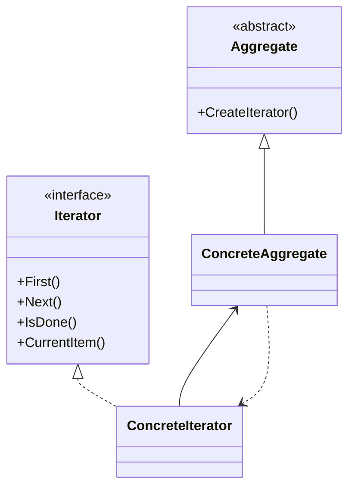
```mermaid
classDiagram
    %% 抽象容器
    class Aggregate {
        <<abstract>>
        +CreateIterator()
    }
    %% 抽象迭代器
    class Iterator {
        <<interface>>
        +First()
        +Next()
        +IsDone()
        +CurrentItem()
    }
    %% 具体容器
    class ConcreteAggregate
    %% 具体迭代器
    class ConcreteIterator
    Aggregate <|-- ConcreteAggregate
    Iterator <|.. ConcreteIterator
    ConcreteAggregate <-- ConcreteIterator
    ConcreteAggregate ..> ConcreteIterator
```

#### 观察者模式

> 定义:定义对象间一种一对多的依赖关系,使得每当一个对象改变状态,则所有依赖于它的对象都会得到通知并被自动更新.

类图:

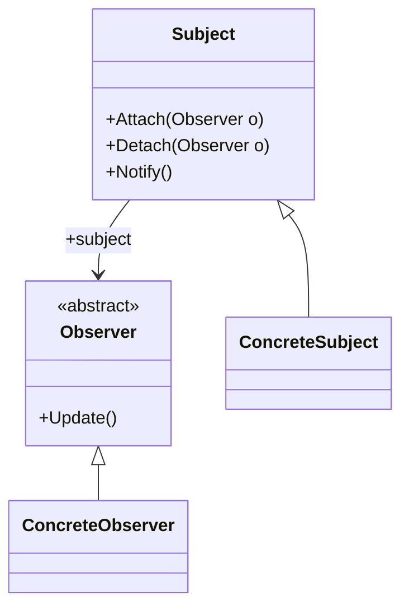
```mermaid
classDiagram
    %% 被观察者
    class Subject {
        +Attach(Observer o)
        +Detach(Observer o)
        +Notify()
    }
    %% 观察者
    class Observer {
        <<abstract>>
        +Update()
    }
    %% 具体的被观察者
    class ConcreteSubject
    %% 具体的观察者
    class ConcreteObserver
    Subject <|-- ConcreteSubject
    Observer <|-- ConcreteObserver
    Subject --> Observer : +subject
```

#### 中介模式

> 定义:用一个中介对象封装一系列的对象交互,中介者使各对象不需要显示的相互作用,从而使其耦合松散,而且可以独立的改变它们之间的交互.

类图:

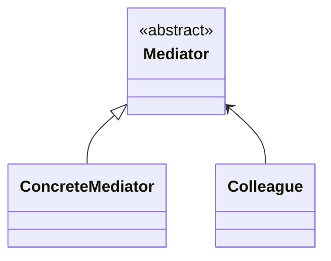
```mermaid
classDiagram
    %% 抽象中介者角色
    class Mediator {
        <<abstract>>
    }
    %% 具体中介者角色
    class ConcreteMediator
    %% 同事角色
    class Colleague
    Mediator <|-- ConcreteMediator
    Mediator <-- Colleague
```

#### 备忘录模式

> 定义:在不破坏封装性的前提下,捕获一个对象的内部状态,并在该对象之外保存这个状态.这样以后就可将该对象恢复到原先保存的状态.

类图:

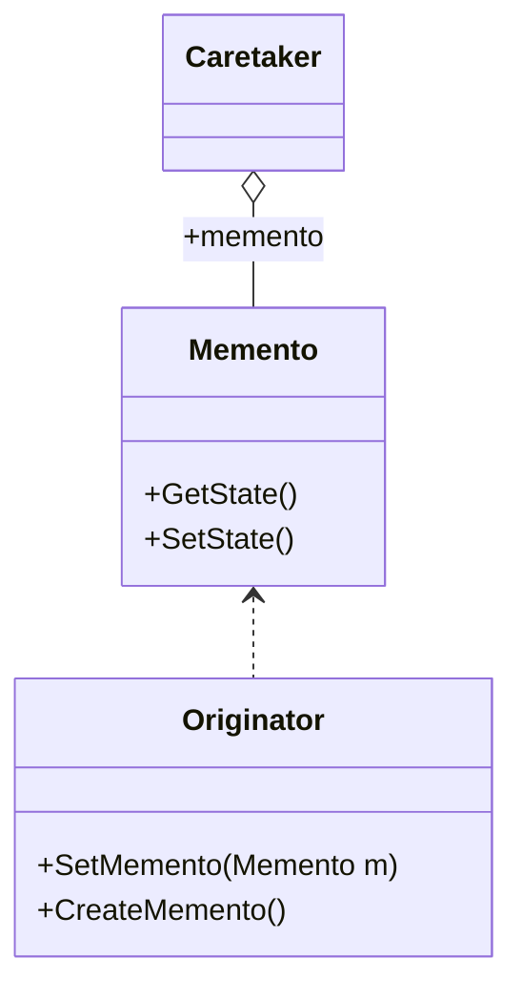
```mermaid
classDiagram
    %% 发起人角色
    class Originator {
        +SetMemento(Memento m)
        +CreateMemento()
    }
    %% 备忘录角色
    class Memento {
        +GetState()
        +SetState()
    }
    %% 备忘录管理员角色
    class Caretaker
    Memento <.. Originator
    Caretaker o-- Memento : +memento
```

#### 解释器模式

> 定义:给定一门语言,定义它的文法的一种表示,并定义一个解释器,该解释器使用该表示来解释语言中的句子.

类图:

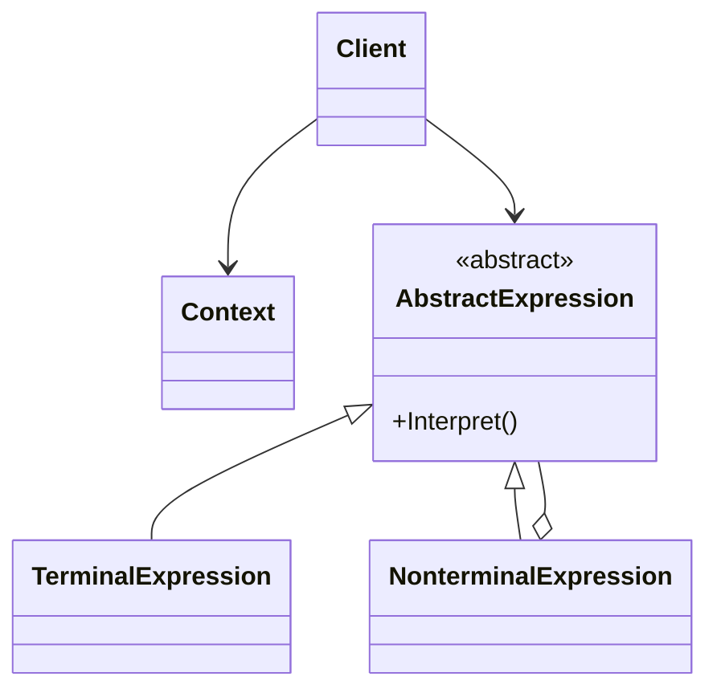
```mermaid
classDiagram
    class Client
    %% 环境角色
    class Context
    %% 抽象解释器
    class AbstractExpression {
        <<abstract>>
        +Interpret()
    }
    %% 终结符表达式
    class TerminalExpression
    %% 非终结符表达式
    class NonterminalExpression
    AbstractExpression <|-- TerminalExpression
    AbstractExpression <|-- NonterminalExpression
    NonterminalExpression o-- AbstractExpression
    Client --> Context
    Client --> AbstractExpression
```

#### 状态模式

> 定义:当一个对象内在状态改变时允许其改变行为,这个对象看起来像改变了其类.

类图:

```mermaid
classDiagram
    %% 环境角色
    class Context {
        +Request()
    }
    %% 抽象状态角色
    class State {
        <<abstract>>
        +Handle()
    }
    %% 具体状态角色
    class ConcreteState
    State <|-- ConcreteState
    Context o-- State : +state
```

#### 策略模式

> 定义:定义一组算法,将每个算法都封装起来,并且使他们之间可以互换.

类图:

```mermaid
classDiagram
    class Context {
        <<abstract>>
        +ContextInterface()
    }
    class Strategy {
        <<abstract>>
        +AlgorithmInterface()
    }
    class ConcreteStrategy
    Strategy --o Context : +strategy
    Strategy <|-- ConcreteStrategy
```

#### 责任链模式

> 定义:使多个对象都有机会处理请求,从而避免了请求的发送者和接受者之间的耦合关系.将这些对象连成一条链,并沿着这条链传递该请求,直到有对象处理它为止.

类图:

```mermaid
classDiagram
    class Client
    class Handler {
        <<abstract>>
        +HandleRequest()
    }
    class ConcreteHandler
    Handler <-- Handler : +successor
    Handler <|-- ConcreteHandler
    Handler <-- Client
```

## 参考链接

* [设计模式视频](https://www.youtube.com/playlist?list=PLmOn9nNkQxJH-C-qEI2rpewHTI9ITpMkt)
* [设计模式之禅](https://book.douban.com/subject/25843319/)
