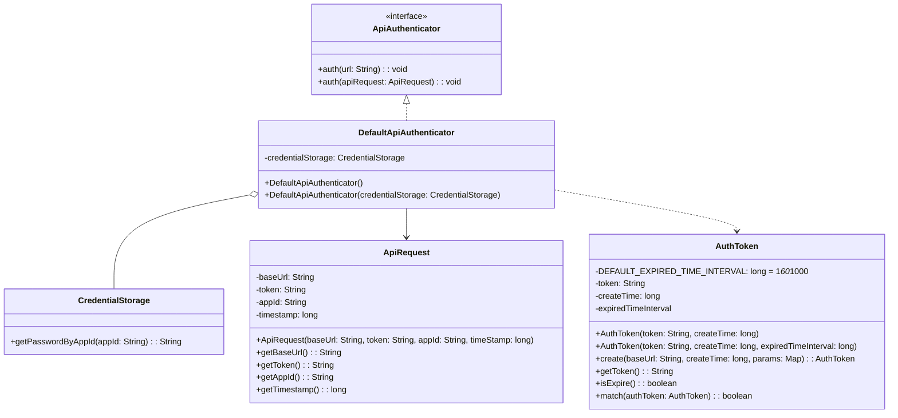

通过一个接口鉴权项目来演示面向对象分析（OOA），面向对象设计（OOD）、面向对象编程（OOP）。

<!--more-->

## 面向对象分析（OOA）

### 原始需求

为了保证接口调用的安全性，我们希望设计实现一个接口调用鉴权功能，只有经过认证之后的系统才能调用我们的接口，没有认证过的系统调用我们的接口会被拒绝。

### 第一轮分析

为了区分经过认证系统和非认证系统，我们需要给每个认证系统分配唯一标识，最简单的就是直接分配账号和密码，给每个认证系统派发一对 AppID 和密码。调用方每次调用接口时，需要将 AppID 和密码传递过来，服务端需要和自己存储的进行比对验证。

缺点：每次验证都传递的明文密码，就算密码进行单独加密也是可以被拦截然后用于伪造请求。

### 第二轮分析

为了解决明文密码问题，我们可以引用数字签名的思路，调用方和服务端通过统一的加密方式生成 token（签名），比如通过 URL、AppID 和密码。服务端只需要对比调用方传递过来的 token 是否一致即可，隐藏具体的加密方式和加密用的信息。

缺点：token 生成后是固定的，可以被拦截然后用于伪造请求。

### 第三轮分析

为了解决 token 生成固定的问题，可以引入随机变量让每次生成的 token 不一样，比如加上时间戳，让 token 只在时间戳后很小一段时间内有效。

缺点：token 一小段时间内还是固定。

权衡安全性、开发成本、对系统性能的影响，这个方案算是可以接受的。

### 第四轮分析

就原始需求来说，调用方和服务端之间的鉴权验证没什么问题了，但是我们引入了 AppID 和密码，就引入了新的问题：AppID 和密码的存储和查询。存储和查询方式后续可能变化，所以这块必须保证灵活性和扩展性。

### 最终需求

1. 调用方进行接口请求的时候，将 URL、AppID、密码、时间戳拼接在一起，通过加密算法生成 token，并且将 token、AppID、时间戳拼接在 URL 中，一并发送到服务端。
2. 服务端在接收到调用方的接口请求之后，从请求中拆解出 token、AppID、时间戳。
3. 服务端首先检查传递过来的时间戳跟当前时间，是否在 token 失效时间窗口内。如果已经超过失效时间，那就算接口调用鉴权失败，拒绝接口调用请求。
4. 如果 token 验证没有过期失效，微服务端再从自己的存储中，取出 AppID 对应的密码，通过同样的 token 生成算法，生成另外一个 token，与调用方传递过来的 token 进行匹配；如果一致，则鉴权成功，允许接口调用，否则就拒绝接口调用。

## 面向对象设计（OOD）

### 功能点拆解

对最终需求进行功能点拆解：

1. （token 相关）把 URL、AppID、密码、时间戳拼接为一个字符串。
2. （token 相关）对字符串通过加密算法加密生成 token。
3. （url 相关）将 token、AppID、时间戳拼接到 URL 中，形成新的 URL
4. （url 相关）解析 URL，得到 token、AppID、时间戳等信息
5. （账号相关）从存储中取出 AppID 和密码
6. （token 相关）根据时间戳判断 token 是否过期失效
7. （token 相关）验证两个 token 是否匹配

### 定义类

功能点拆解之后发现有三个概念：token、url、账号，就可以提取成三个类：`AuthToken`、`ApiRequest`、`CredentialStorage`，然后根据功能点，提取每个类的属性和方法、以及他们之间的关联。同时为了更好的对外提供服务，提取一个 `ApiAuthenticator` 接口及默认实现 `DefaultApiAuthenticator` 作为整个鉴权的入口。



## 面向对象编程（OOP）

根据 OOD 的类图进行实现。

### AuthToken

```java
import java.util.Base64;
import java.util.Date;
import javax.crypto.Mac;
import javax.crypto.spec.SecretKeySpec;

public class AuthToken {

  private static final long EXPIRE_INTERVAL = 10 * 60 * 1000L;
  private long createTime;
  private String token;
  private String originalUrl;

  public boolean isExpired() {
    if (this.createTime > new Date().getTime() + EXPIRE_INTERVAL) {
      return true;
    }
    return false;
  }

  public boolean match(AuthToken authToken) {
    if (this.token.equals(authToken.token)) {
      return true;
    }
    return false;
  }

  public AuthToken(String originalUrl, long createTime, String token) {
    this.originalUrl = originalUrl;
    this.createTime = createTime;
    this.token = token;
  }

  public AuthToken(String token) {
    this.token = token;
  }

  public static AuthToken buildAuthToken(ApiRequest req, String password) {
    // srcStr format:
    // "GETcvm.api.qcloud.com/v2/index.php?"
    //        + "AppID=AKIDz8krbsJ5yKBZQpn74WFkmLPx3gnPhESA"
    //        + "&Timestamp=1465185768";
    String srcStr = ""; // TODO
    srcStr = "geekbang?"
        + "AppID=designpattern"
        + "&Timestamp=1465185768";
    String token = generateToken(srcStr, password);
    System.out.println("buildAuthToken: " + token);
    AuthToken authToken = new AuthToken(token);
    return authToken;
  }

  public static String generateToken(String value, String key) {
    return hmacSha1(value, key);
  }


  private static String hmacSha1(String value, String key) {
    try {
      // Get an hmac_sha1 key from the raw key bytes
      byte[] keyBytes = key.getBytes();
      SecretKeySpec signingKey = new SecretKeySpec(keyBytes, "HmacSHA1");

      // Get an hmac_sha1 Mac instance and initialize with the signing key
      Mac mac = Mac.getInstance("HmacSHA1");
      mac.init(signingKey);

      // Compute the hmac on input data bytes
      byte[] rawHmac = mac.doFinal(value.getBytes());

      byte[] result = Base64.getEncoder().encode(rawHmac);

      //  Covert array of Hex bytes to a String
      return new String(result, "UTF-8");
    } catch (Exception e) {
      throw new RuntimeException(e);
    }
  }

  public static void main(String[] args) {
    System.out.println(hmacSha1("sdf", "23"));
  }
}
```

### CredentialStorage

```java
public interface CredentialStorage {
    String getPasswordByAppID(String appId);
}
```

```java
public class MySqlCredentialStorage implements CredentialStorage {
    @Override
    public String getPasswordByAppID(String appId) {
        return "123";
    }
}
```

### ApiRequest

```java
public class ApiRequest {

  private String baseUrl;
  private String appID;
  private long timeStamp;
  private String token;

  public ApiRequest(String fullUrl) {

    Map<String, String> params = parse(fullUrl);
    // TODO
    String baseUrl = "";
    String appID = "";
    long timeStamp = 0L;
    String token = "";
  }

  public static ApiRequest genFakeReq(String fullUrl) {
    ApiRequest req = new ApiRequest("geekbang", "designpattern", new Date().getTime(),
        "IXIGIpJ9hdOBCyjStaDJ5Nom07g=");
    return req;
  }

  private static Map<String, String> parse(String fullUrl) {
    Map<String, String> params = new TreeMap<>();
    // TODO
    return params;
  }


  public ApiRequest(String baseUrl, String appID, long timeStamp, String token) {
    this.baseUrl = baseUrl;
    this.appID = appID;
    this.timeStamp = timeStamp;
    this.token = token;
  }

  public String getBaseUrl() {
    return baseUrl;
  }

  public String getAppID() {
    return appID;
  }

  public long getTimeStamp() {
    return timeStamp;
  }

  public String getToken() {
    return token;
  }
}
```

### ApiAuthenticator

```java
public interface ApiAuthenticator {
  void auth(String url);
  void auth(ApiRequest apiRequest);
}
```

```java
public class DefaultApiAuthenticatorImpl implements ApiAuthenticator {
  private CredentialStorage credentialStorage;
  
  public DefaultApiAuthenticator() {
    this.credentialStorage = new MysqlCredentialStorage();
  }
  
  public DefaultApiAuthenticator(CredentialStorage credentialStorage) {
    this.credentialStorage = credentialStorage;
  }

  @Override
  public void auth(String url) {
    ApiRequest apiRequest = ApiRequest.buildFromUrl(url);
    auth(apiRequest);
  }

  @Override
  public void auth(ApiRequest apiRequest) {
    String appId = apiRequest.getAppId();
    String token = apiRequest.getToken();
    long timestamp = apiRequest.getTimestamp();
    String originalUrl = apiRequest.getOriginalUrl();

    AuthToken clientAuthToken = new AuthToken(token, timestamp);
    if (clientAuthToken.isExpired()) {
      throw new RuntimeException("Token is expired.");
    }

    String password = credentialStorage.getPasswordByAppId(appId);
    AuthToken serverAuthToken = AuthToken.generate(originalUrl, appId, password, timestamp);
    if (!serverAuthToken.match(clientAuthToken)) {
      throw new RuntimeException("Token verfication failed.");
    }
  }
}
```

## 参考链接

* [设计模式之美-极客时间](https://time.geekbang.org/column/intro/250)