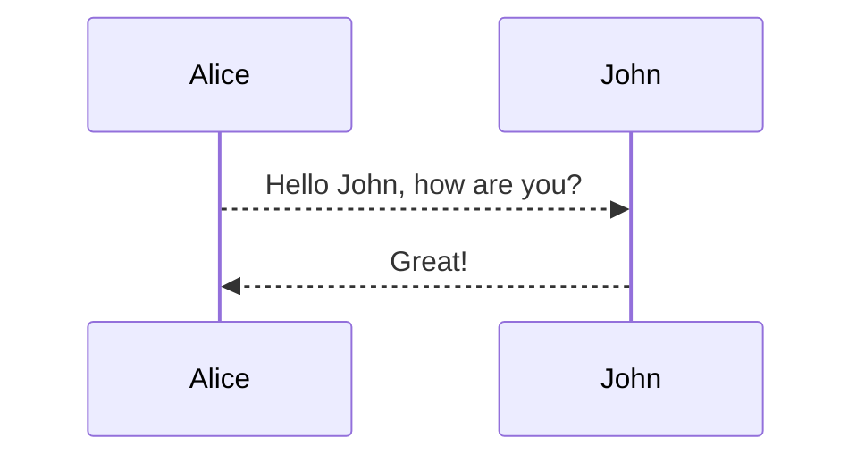

### 标题

`#` 后面保持空格

```markdown
# h1
## h2
### h3
#### h4
##### h5
###### h6
####### h7      // 错误代码
######## h8     // 错误代码
######### h9    // 错误代码
########## h10  // 错误代码
一级标题
======================
二级标题
---------------------
```

### 引用

单行引用

```markdown
> hello world!
```

多行引用

```markdown
> hello world!
hello world!
hello world!
```

```markdown
> hello world!
> hello world!
> hello world!  
```

多层嵌套

```markdown
> aaaaaaaaa
>> bbbbbbbbb
>>> cccccccccc
```

### 代码块

单行使用单反引号

```markdown
标记之外`hello world`标记之外
```

多行使用三个反引号

```markdonw
    ```html
    <div>
        <div></div>
        <div></div>
        <div></div>
    </div>
```
```

或者 TAB 缩进

​```markdonw
    <div>
        <div></div>
        <div></div>
        <div></div>
    </div>
```

### 链接

链接有两种方法:  行内式和参考式

1. 行内式

    ```markdown
    This is [an example](http://example.com/ "Title") inline link.
    See my [About](/about/) page for details.
    ```

2. 参考式

    ```markdown
    This is [an example][id] reference-style link.
    [id]: http://example.com/  "Optional Title Here"
    ```

链接内容定义的形式为：

- 方括号（前面可以选择性地加上至多三个空格来缩进），里面输入链接文字
- 接着一个冒号
- 接着一个以上的空格或制表符
- 接着链接的网址
- 选择性地接着 title 内容，可以用单引号、双引号或是括弧包着

### 图片

```markdown


![name][01]
[01]: ./01.png '描述'

[](http://www.baidu.com){:target="_blank"}        // 内链式

[][5]{:target="_blank"}                       // 引用式
[5]: http://www.baidu.com
```

### 列表

有序的

```markdown
1. one
2. two
3. three
```

无序的

```markdown
* one
* two
* three
```

列表嵌套代码块

```markdown
* one

    var a = 10;     // 与上行保持空行并 递进缩进
```

任务列表

```markdown
这是文字……

- [x] 选项一
- [ ] 选项二  
- [ ]  [选项3]
```

### 表格

`:` 代表对齐方式 , 与`|`之间不要有空格

```markdown
|    a    |       b       |      c     |
|:-------:|:------------- | ----------:|
|   居中  |     左对齐    |   右对齐   |
|=========|===============|============|
```

### 分割符

```markdown
***
---
* * *
```

### 脚注

```markdown
Markdown[^1]
[^1]: Markdown是一种纯文本标记语言        // 在文章最后面显示脚注
```

### 注释

1. 使用 `html` 的注释

    ```html
    <!--- your comment goes here and here -->
    ```

2. 使用链接的参考式

    ```markdown
    [comment]: <> (This is a comment, it will not be included)
    [comment]: <> (in  the output file unless you use it in)
    [comment]: <> (a reference style link.)
    [//]: <> (This is also a comment.)
    [//]: # (This may be the most platform independent comment)

    [^_^]:
        commentted-out contents
        should be shift to right by four spaces (`>>`).
    ```

### mermaid



### sequence

```sequence
Andrew->China: Says Hello
Note right of China: China thinks\nabout it
China-->Andrew: How are you?
Andrew->>China: I am good thanks!
```

### flowchart

```flow
st=>start: Start
e=>end
op1=>operation: My Operation
sub1=>subroutine: My Subroutine
cond=>condition: Yes
or No?
io=>inputoutput: catch something...

st->op1->cond
cond(yes)->io->e
cond(no)->sub1(right)->op1
```

### mathjax

When $$(a \ne 0)$$, there are two solutions to $$(ax^2 + bx + c = 0)$$ and they are

$$x = {-b \pm \sqrt{b^2-4ac} \over 2a}.$$

[^1]: Here is the footnote 1 definition.
