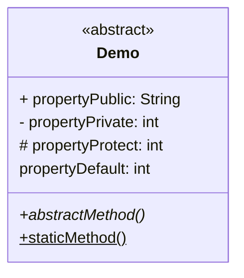
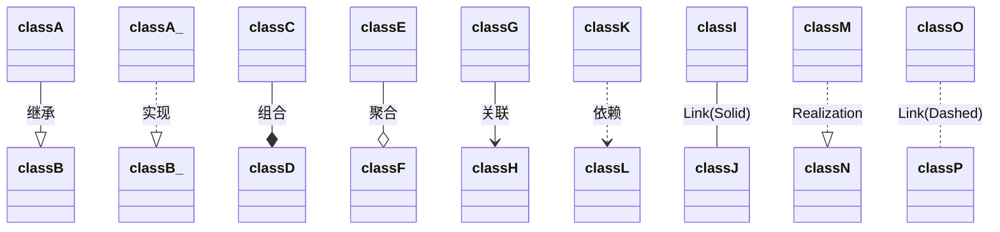

Mermaid 是一个可以使用文字画流程图、时序图、甘特图、状态图的库。

### 流程图

基本的语法格式:

```markdown
graph 方向描述
    图表中的其他语句...
```

示例:

```markdown
graph TD
A[Christmas] -->|Get money| B(Go shopping)
B --> C{Let me think}
C -->|One| D[Laptop]
C -->|Three| F[fa:fa-car Car]
```

#### 方向描述

| 方向描述 | 含义     |
| -------- | -------- |
| TB       | 从上到下 |
| BT       | 从下到上 |
| RL       | 从右到左 |
| LR       | 从左到右 |

#### 其他语句

其他语句包含了节点、连线、子流程，节点之间通过连线连接。其他语句的文字如果有标点符号则需要用双引号包裹，如果要换行需要使用 html 的换行符 `<br/>`。

##### 节点

| 节点       | 含义           |
| ---------- | -------------- |
| id[文字]   | 矩形节点       |
| id(文字)   | 圆角矩形节点   |
| id((文字)) | 圆形节点       |
| id>文字]   | 右向旗帜状节点 |
| id{文字}   | 菱形节点       |

##### 连线

| 连线     | 含义           |
| -------- | -------------- |
| >        | 添加尾部箭头   |
| -        | 不添加尾部箭头 |
| --       | 单线           |
| --text-- | 单线上加文字   |
| ==       | 粗线           |
| ==text== | 粗线加文字     |
| -.-      | 虚线           |
| -.text.- | 虚线加文字     |

##### 子流程

```markdown
subgraph 子图表名称
    子图表中的描述语句...
end
```

### 时序图

基本语法格式:

```markdown
sequenceDiagram
    [参与者1][消息线][参与者2]:消息体
    ...
```

表明 参与者1 发送消息体给 参与者2

#### 参与者

可以先声明参与者:

```markdown
sequenceDiagram
    participant 参与者 1
    participant 参与者 2
    ...
    participant 简称 as 参与者 3
```

#### 消息线

| 类型 | 描述                       |
| ---- | -------------------------- |
| ->   | 无箭头的实线               |
| -->  | 无箭头的虚线               |
| ->>  | 有箭头的实线               |
| -->> | 有箭头的虚线               |
| -x   | 末端为叉的实线（表示异步） |
| --x  | 末端为叉的虚线（表示异步） |

末尾增加 + ，则消息接收者进入当前消息的“处理中”状态；
末尾增加 - ，则消息接收者离开当前消息的“处理中”状态。

#### 标注

语法格式:

```markdown
Note 位置表述 参与者: 标注文字
```

| 位置表述 | 含义                       |
| -------- | -------------------------- |
| right of | 右侧                       |
| left of  | 左侧                       |
| over     | 在当中，可以横跨多个参与者 |

#### 循环

```markdown
loop 循环的条件
    循环体描述语句
end
```

#### 判断

```markdown
alt 条件 1 描述
    分支 1 描述语句
else 条件 2 描述 # else 分支可选
    分支 2 描述语句
else ...
    ...
end
```

或者没有 else 的情况:

```markdown
opt 条件描述
    分支描述语句
end
```

### 甘特图

基本语法格式:

```markdown
gantt
dateFormat  时间格式
title 标题
section 模块名称
任务名  :[别名,][开始日期,][持续时间]
```

示例:

```markdown
gantt
title 甘特图
dateFormat  YYYY-MM-DD
section 项目A
任务1           :a1, 2018-06-06, 30d
任务2     :after a1  , 20d
section 项目B
任务3      :2018-06-12  , 12d
任务4      : 24d
```

### 类图

语法格式：

```markdown
classDiagram
    类声明
    类关联
```

#### 类声明

类的属性/方法可以一行行声明：

```markdown
class BankAccount
BankAccount : +String owner
BankAccount : +BigDecimal balance
BankAccount : +deposit(amount)
BankAccount : +withdrawal(amount)
```

也可以使用 `{}` 包裹属性/方法：

```markdown
class BankAccount {
    +String owner
    +BigDecimal balance
    +deposit(amount)
    +withdrawal(amount)
}
```



属性的语句格式是：`[可见性 ]名称[: 类型]`
方法的语句格式是：`[可见性]名称(参数类型 参数名，...)[后缀][ 返回类型]`

可见性、后缀有如下可选值：

| 符号 | 含义                                      |
| ---- | ----------------------------------------- |
| +    | 公开的(Public)                            |
| -    | 私有的(Private)                           |
| #    | 保护的(Protected)                         |
| ~    | 包内的(Package/Internal)                  |
| *    | 抽象方法(注意现在方法参数必须是无参或单参 |
| $    | 静态方法(注意现在方法参数必须是无参或单参 |

#### 类关联

类关联的语法：`[classA][Arrow][ClassB]:LabelText`

支持的关联有：

```markdown
%% 少了实现
classA --|> classB : 继承
classA_ ..|> classB_ : 实现
classC --* classD : 组合
classE --o classF : 聚合
%% 语义级别的强关联 长期的 关联 比 依赖 更加耦合
classG --> classH : 关联  
%% 偶然、临时性的使用
classK ..> classL : 依赖

classI -- classJ : Link(Solid)
classM ..|> classN : Realization
classO .. classP : Link(Dashed)
```


